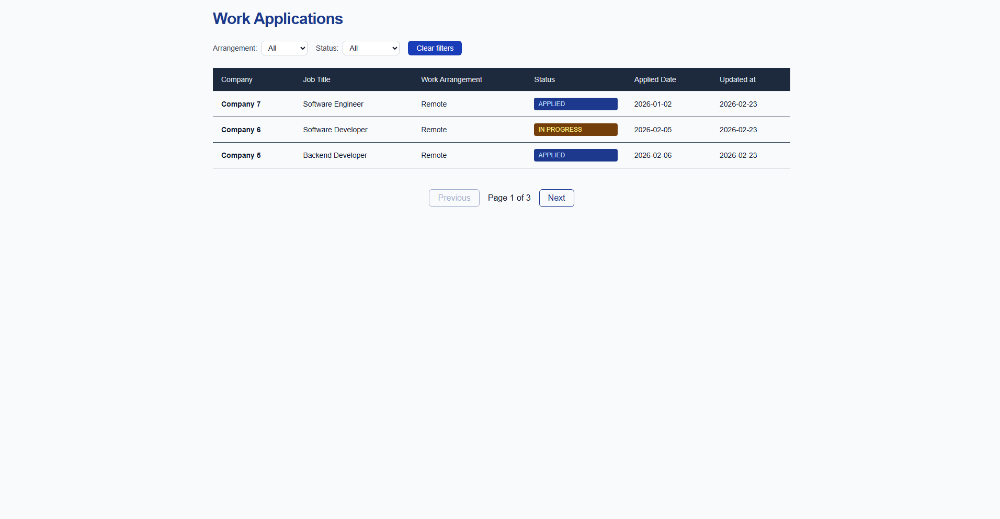
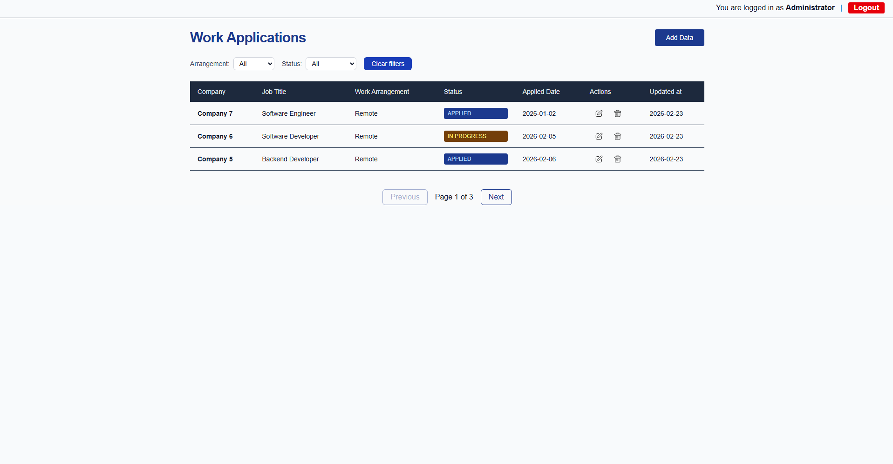
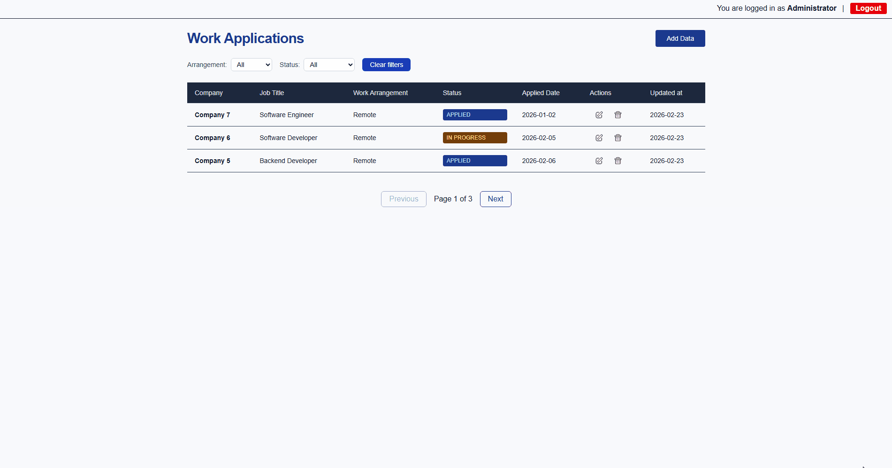
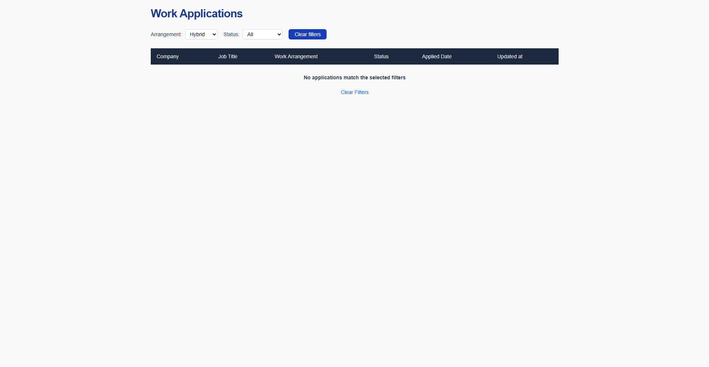

# Job Application Tracker

[](https://github.com/gastin0/job-tracker-auth/actions/workflows/ci.yml)  

A production-minded full-stack job application tracking system built with **Next.js App Router**, **MongoDB**, **NextAuth authentication**, **pagination** and **Docker support**.
Designed as a portfolio project demonstrating clean architecture, secure admin separation, proper server/client boundaries, and scalable CRUD workflows.

> Focus: **architectural clarity, correctness, and backend-oriented thinking**.

---

## ✨ Highlight
- **Next.js App Router** (Server + Client Components)
- **NextAuth session-based authentication**
- **Role-based admin gating**
- **RESTful API routes** (`GET / POST / PUT / DELETE`)
- **Server-side pagination**
- **MongoDB Atlas** with shared `clientPromise` connection pattern
- **Data access abstraction layer** (`applicationRepo`)
- **Accessible UX** (keyboard & focus management)
- **Continous Integration (Github Actions)**
- **Dockerized deployment setup (included in main branch)**

---

## 🛠 Tech Stack
- **Framework**: Next.js (App Router)
- **Auth**: NextAuth (session-based, bcrypt-hased credentials)
- **Frontend**: React, Tailwind CSS
- **Backend**: Next.js Route Handlers
- **Database**: MongoDB Atlas
- **Containerization**: Docker
- **Tooling**: ESLint, PostCSS, GitHub Actions (CI)

---

##  🧠 Data Model (Canonical Schema)
Each application follows a fixed schema:
```json
{
  companyName: string,
  jobTitle: string,
  workArrangement: string,
  applicationStatus: string,
  applicationDate: Date,
  notes: string,
  createdAt: Date,
  updatedAt: Date
}
```
- `createdAt` is set on creation.
- `updatedAt` is updated on every modification.
- `_id` is serialized to string before returning to client.

---

## 🔐 Authentication & Authorization
Authentication is implemented via **NextAuth**, with user credentials stored and validated against MongoDB.
No hardcoded admin credentials or email-based env configuration are used.
- Passwords are securely hashed using bcrypt before storage
- Credential comparison uses bcrypt hash verification

### Public Access
- `/applications` is publicly accessible (read-only mode).

### Admin Access
- Create, Edit, and Delete require an authenticated admin session.
- Admin state derived via `useSession()`.
- UI gating uses hydration-safe pattern:
```js
mounted && isAdmin
```

### API Protection
Mutation routes validate session before allowing:
- POST
- PUT
- DELETE
No reliance on client-side secrets.

---

## 📸 Screenshots

### Public Applications View


### Admin View (CRUD Enabled)


*Admin controls are conditionally rendered based on session state.*

### Delete Confirmation Modal


Accessible destructive flow with:
- Focus trapping
- Escape handling
- Backdrop cancel
- Controlled delete state machine
- Focus restoration

### Application Form


### Empty State

*Empty state clearly indicates that no results match the active filters and provide a reset action.*

---

## 📄 Server-Side Filtering & Pagination
Filtering and pagination are executed on the server for scalability.

### Server Responsibilities
- Query parameters derived from searchParams.
- MongoDB query constructed with:
  - filter conditions (status, workArrangement, etc.)
  - `skip`
  - `limit`
  - sorted results
- Total count calculated for proper page navigation

This prevents:
- Large dataset overfetching
- Client-side slicing
- UI/data inconsistency

Designed to scale beyond small portfolio datasets.

---

## 📂 Project Structure (Simplified)
```
.
├── ARCHITECTURE.md
├── Dockerfile
├── README.md
├── public/
│   ├── icons/
│   └── ...
├── screenshots/
├── src/
│   ├── app/
│   │   ├── applications/          # Public read-only list
│   │   ├── admin/                 # Admin routes (create/edit/manage)
│   │   ├── api/
│   │   │   ├── applications/
│   │   │   └── auth/[...nextauth]/
│   │   ├── login/
│   │   └── layout.js
│   ├── components/                # UI components & client logic
│   ├── lib/                       # Repository layer & DB utilities
│   │   ├── applicationsRepo.js
│   │   └── mongodb.js
│   ├── auth.ts                    # NextAuth configuration
│   ├── proxy.ts
│   └── types/
└── configuration files...
```

---

## 🏗️ Architecture

### 1. Server Layer
- Fetches paginated data and filtered data
- Constructs MongoDB queries based on search parameters
- Validates authentication for protected routes
- Executes database operations via repository layer

### 2. Client Layer
- Derives admin session
- Controls delete modal state machine
- Uses `router.refresh()` after mutations

### 3. Data Access Layer
`applicationsRepo` abstracts:
- `getAllApplications` (with pagination)
- `createApplication`
- `updateApplication`
- `deleteApplication`
Ensures:
- ObjectId serialization
- Timestamp management
- Clean separation from route handlers

For detailed reasoning and trade-offs, see [ARCHITECTURE.md](./ARCHITECTURE.md).

---

## 🗑️ Delete UX
Custom modal implementation includes:
- Controlled state machine: `idle → confirm → loading → success`
- Focus trapping
- Escape handling
- Backdrop click cancel
- Artificial success delay
- Focus restoration to trigger button
- Calls `router.refresh()` after deletion
No `window.confirm`.

Designed to simulate production-grade destructive workflows.
---

## ✅ Continuous Integration
Github Actions pipeline runs on every push to `main`:
- Run ESLint
- Install dependencies
- Execute production build
- Build Docker image
- Push Docker image to Docker Hub (on successful build)

Ensures:
- Code quality validation
- Build verification
- Deployment artifact consistency

See: [CI workflow](.github/workflows/ci.yml)

---

## 🐳 Docker Support
Docker images are available on **Docker Hub**. Configuration is included in the main branch.

### Build & Run
```bash
docker pull gastin0/job-tracker-auth:latest
docker run -p 3000:3000 --env-file .env.production gastin0/job-tracker-auth:latest
```
Or with compose:
```bash
docker-compose up --build
```
Environment variables must be provided via `.env` or docker-compose file.
The image is automatically built and published via GitHub Actions CI pipepline.

---

## 📌 Project Scope & Design Decisions
This project intentionally:
- Uses session-based authentication instead of JWT tokens
- Separates server data fetching from client interactivity
- Implements real pagination instead of client slicing
- Focuses on **architectural quality** over **feature quantity**
Deliberately avoids:
- Multi-user roles
- OAuth providers (currently single-admin model)
- Complex caching layers

---

## 🚀 Getting Started
```bash
git clone <repository-url>
cd job-tracker-auth
npm install
npm run dev
```

Create a `.env.local` file:
```env
MONGODB_URI=your_mongodb_connection_string
NEXTAUTH_SECRET=your_admin_secret
NEXTAUTH_URL=http://localhost:3000
```

---

## 🧠 Why This Project Exists
This project demonstrates:
- Backend-oriented full-stack architecture
- Session-based authentication
- Proper App Router patterns
- MongoDB abstraction layering
- Pagination and scalability thinking
- Accessible UX implementation
- Dockerized deployment readiness

It represents a progression from basic CRUD to production-minded system design.
